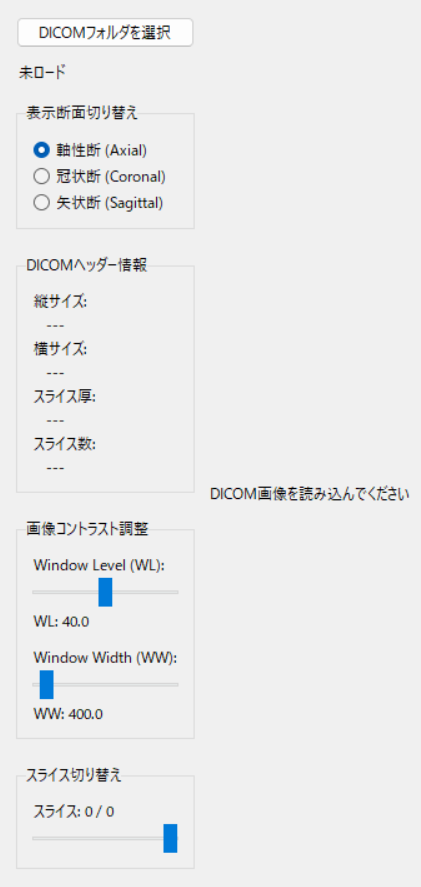
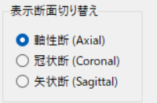
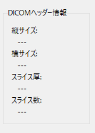
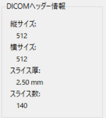
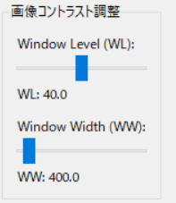
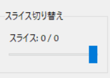
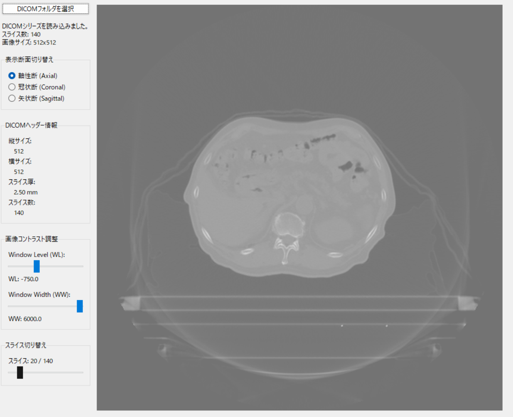

# DICOM Viewer 操作マニュアル

## 1. 概要

本プログラムは、Pythonと汎用ライブラリ（pydicom, numpy, tkinter, Pillow）を使用して開発されたDICOM画像ビューアである。CTまたはMRIの画像系列データを読み込み、軸性断（Axial）、冠状断（Coronal）、矢状断（Sagittal）の3断面で画像を観察し、Window Level (WL) および Window Width (WW) の調整や、スライス切り替えを行うことができる。

## 2. 動作環境

* OS: Windows, macOS, Linux (Pythonが動作する環境)
* 必要なライブラリ: pydicom, numpy, Pillow (PillowはPIL互換ライブラリである)

## 3. 起動方法

1.  上記の必要ライブラリをインストールする。
    ```bash
    pip install pydicom numpy Pillow
    ```
2.  `dicom_viewer.py` ファイルを実行する。
    ```bash
    python dicom_viewer.py
    ```
3.  TkinterベースのGUIウィンドウが起動する。

## 4. DICOMデータの読み込み

1.  GUI左上にある「**DICOMフォルダを選択**」ボタンをクリックする。
2.  DICOMファイル（\*.dcm）が格納されているフォルダを選択する。
3.  読み込みが成功すると、ステータスラベルに「DICOMシリーズを読み込みました」というメッセージと、スライス数や画像サイズが表示される。

## 5. 基本操作（マウス）

画像表示エリア上でのマウス操作により、直感的な調整が可能である。

| 操作 | 機能 | 動作 |
| :--- | :--- | :--- |
| **左クリック＆ドラッグ（上下）** | Window Level (WL) 調整 | 上にドラッグでWLを下げ、下にドラッグでWLを上げる。 |
| **左クリック＆ドラッグ（左右）** | Window Width (WW) 調整 | 右にドラッグでWWを広げ、左にドラッグでWWを狭める。 |
| **マウスホイール** | スライス切り替え | ホイールを上に回すと次のスライスへ、下に回すと前のスライスへ移動する。 |
| **右クリック＆ドラッグ（上下）** | スライス切り替え | 上にドラッグで次のスライスへ、下にドラッグで前のスライスへ移動する。 |

## 6. コントロールパネルの操作

GUI左側のコントロールパネルには、以下の機能が配置されている。



### 6.1 表示断面切り替え (MPR)

表示したい断面のラジオボタンを選択することで、画像再構成（MPR）が実行される。

* **軸性断 (Axial):** 体軸に垂直な断面（元のDICOM画像）。
* **冠状断 (Coronal):** 体を前後（腹側・背側）に分ける断面。
* **矢状断 (Sagittal):** 体を左右に分ける断面。



### 6.2 DICOMヘッダー情報

読み込まれたDICOMシリーズの基本情報が表示される。断面を変更しても、元の3Dボリュームの情報（縦横サイズ、スライス厚、スライス数）は保持される。





### 6.3 画像コントラスト調整 (WL/WW)

スライダーを操作することで、WL（中心のHU値）とWW（コントラストの範囲）を数値的に調整できる。

* **Window Level (WL):** スライダーを操作し、画像の中心となるHU値を設定する。
* **Window Width (WW):** スライダーを操作し、表示するHU値の範囲を設定する。



### 6.4 スライス切り替え

スライダーを操作することで、現在選択されている断面の画像番号（スライス）を切り替えることができる。スライダーは現在の断面の最大スライス数に合わせて自動的に範囲が設定される。






## 7. 注意事項

* 本ビューアは、一つのフォルダ内に一つの画像系列（Series Instance UIDが同一）のDICOMファイルが格納されていることを前提として動作する。
* 読み込み時、HU値の最小値と最大値に基づいてWL/WWが自動設定されるため、読み込み直後から適切なコントラストで画像が表示される。
